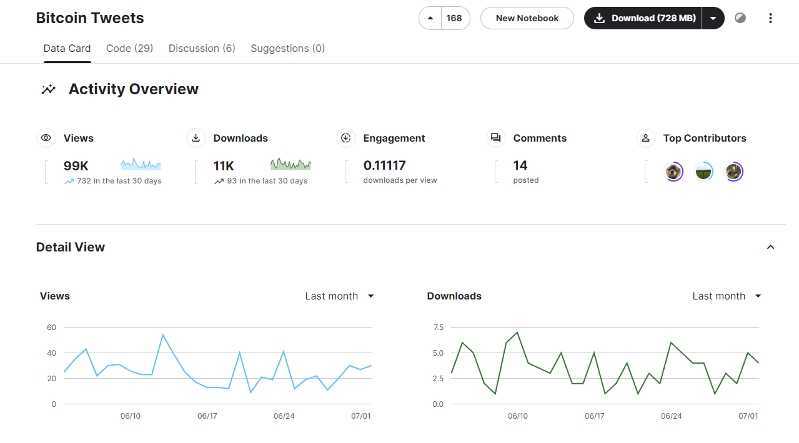

# Data Scientist Capstone Project

Link post on Medium: https://medium.com/@phamduytung999/does-the-sentiment-of-investors-on-twitter-x-influence-the-price-volatility-of-bitcoin-9c8be54fe26c  


## Project Overview 
This project is part of the Udacity Data Scientist Nanodegree. This project aim to answer a simple question: "Does the sentiment of investors on Twitter (X) influence the price volatility of Bitcoin?"

## Files in the repository  
```
|
|---nlp_for_btc_tweets.ipynb (main ipynb file of code)
|---.ipynb_checkpoints
|           |---nlp_for_btc_tweets-checkpoint.ipynb (checkpoint file)
|---images
|           |---dataset_overview.png
|           |---post_background.jpg
|---bitcoin_cleaned_tweets.csv (filtered dataset use in project)
|---README.md (readme file)
|---requirements.txt (require libraries to run ipynb)
```

## Installation
Install the necessary libraries
```bash
pip install -r requirements.txt
```
Run the notebook

## Acknowledge: 
The original source of this dataset is on Kaggle: [Link](https://www.kaggle.com/datasets/kaushiksuresh147/bitcoin-tweets)  
This dataset is extracted from Twitter in it given period, using API connection and python script. The author is only responsible for collecting them.  


